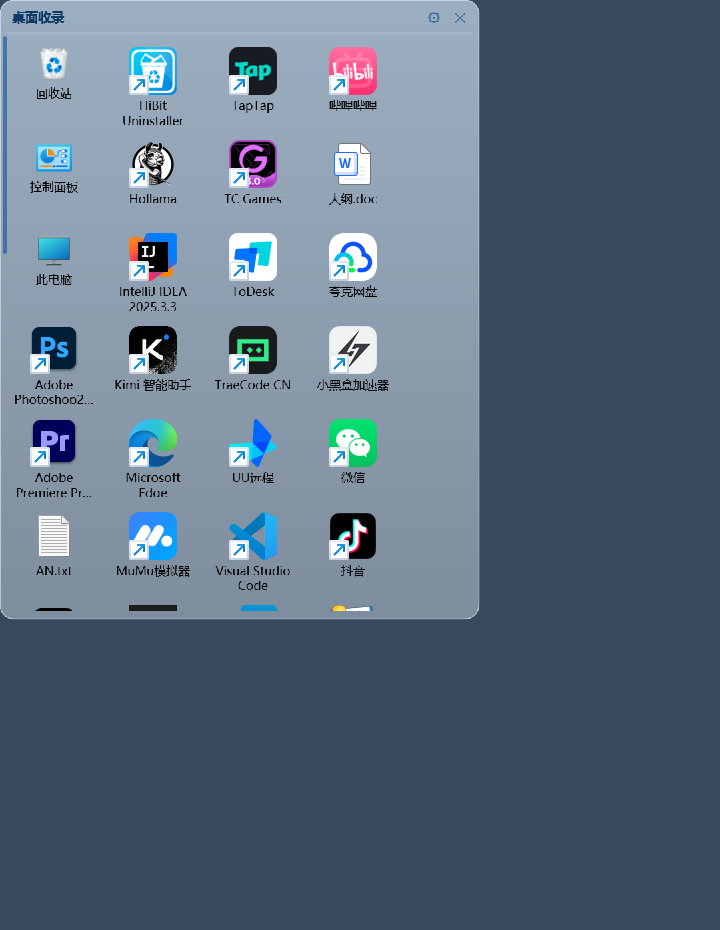

# 桌面收录

把桌面上的图标收进屏幕侧边的半透明面板，热键或鼠标碰边即可呼出，桌面从此保持干净。

- 纯 Python + PyQt5，**无任何额外依赖**（全局热键、任务栏透明、桌面图标控制全部用 ctypes 直接调 Win32 API）
- 只支持 **Windows**（大量使用 Shell / 注册表 / Win32 能力）
- 关闭程序时自动还原对系统做的改动（桌面图标、任务栏样式）



## 功能

**图标收录**
- 启动自动扫描桌面（用户桌面 + 公共桌面）上的快捷方式、文件、文件夹
- 收录系统图标（此电脑、回收站、控制面板等 Shell 命名空间项），按桌面「查看」的勾选状态决定
- 监听桌面目录，新增图标自动进面板、删除自动移除
- 右键面板空白处可添加任意路径的文件或文件夹
- 把桌面快捷方式 / 资源管理器里的文件直接**拖进面板**即可收录（拖到哪个区就归哪个区）
- 失效路径自动清理；移除的图标可从托盘一键恢复

**收纳区（多面板）**
- 多个收纳区各自一个贴边面板，分别收纳不同图标，各有标题、位置、尺寸与热键
- 把图标拖出面板、拖到另一个区松手即可换区；也可右键「移动到收纳区」
- 收纳区可折叠成一条标题栏（▾/▸），设置里可新建 / 重命名 / 删除

**图标定制**
- 右键重命名 / 更换图标 / 恢复默认，全部是**显示层映射，不改动原文件**
- 图标大小 24~72px、文字 7~18pt
- 文字颜色内置 9 色（黑白红橙黄绿蓝淡蓝紫），背景色支持 RGB 三原色自由调节
- 图标透明度、文字透明度、面板透明度三者独立可调
- 可隐藏文字，隐藏时鼠标悬停 0.4 秒显示名称
- 可隐藏快捷方式左下角的小箭头角标

**排列**
- 自由拖动（拖动时跟随鼠标，松手才吸附到网格）
- 拖动拖尾特效：一串逐渐变小淡出的残影，可开关、长度 10 档可调
- 自动排序模式（手动拖动即自动退出）
- 位置与尺寸自动记忆；图标放不下时可滚动查看

**呼出与折叠**
- 每个收纳区可录制各自的全局热键（默认键被占用时自动切换备选键）
- 鼠标移到屏幕边缘自动滑出（主动轮询光标，最大化窗口压在最前也能呼出）
- 面板四周 18px 隐形检测圈，鼠标擦边不会误收起
- 可选「前台全屏或最大化时不弹出」

**系统集成**
- 隐藏系统桌面图标（运行期间持续保持，退出自动还原）
- 任务栏背景透明（不影响图标、时钟、网络状态）
- 开机自启动、托盘菜单、单实例运行
- 按 Win+D 不会把面板最小化

详细清单见 [CHANGELOG.md](CHANGELOG.md)。

## 运行

需要 Python 3.8+ 与 PyQt5：

```bash
pip install -r requirements.txt
python main.py
```

或直接双击 `run.bat`（用 pythonw 启动，不弹控制台）。

## 使用

1. 启动后程序常驻托盘，屏幕侧边只露一条细边
2. 鼠标碰屏幕边缘，或按热键（默认 `Ctrl+Alt+D`）呼出面板
3. 面板空白处右键可添加文件、重新扫描；图标上右键可改名、换图标、移除
4. 托盘菜单可调整置顶、开机自启、隐藏桌面图标、任务栏透明等

所有设置集中在「设置」窗口，分成「本区设置」（收纳区 / 外观 / 图标，只作用于当前选中的那个区）
和「全局设置」（图标与桌面 / 行为，所有区共用）两个选项卡，配置保存在程序目录的 `data/config.json`。

## 打包

```bash
# 主程序
python -m PyInstaller --noconfirm --clean --onefile --windowed --name "桌面收录" main.py

# 安装程序（运行后选择目录即可释放文件并创建桌面快捷方式）
python -m PyInstaller --noconfirm --clean --onefile --windowed --name "桌面收录-安装程序" ^
  --add-data "dist/桌面收录.exe;." --add-data "dist/data/config.json;." installer.py
```

## 项目结构

```
main.py              入口：控制器、托盘菜单、热键兜底
installer.py         安装程序：选目录释放文件、建桌面快捷方式
kjsl/
  panel.py           侧边面板：磁贴布局、拖动、滚动、呼出与折叠、窗口看护
  desktop.py         桌面扫描与条目合并
  shell_items.py     系统图标（Shell 命名空间）枚举与取图
  desktop_icons.py   隐藏 / 还原系统桌面图标
  taskbar.py         任务栏背景透明、自动隐藏
  hotkey.py          全局热键（Win32 RegisterHotKey）
  foreground.py      前台窗口判断、桌面层级判断
  autostart.py       开机自启动
  config.py          配置读写
  settings_dialog.py 设置窗口
  theme.py           配色与字体
```

## 说明

- 配置保存在 `data/config.json`，**不要提交到版本库**（已在 `.gitignore` 中排除）
- 程序会临时修改桌面图标显示与任务栏样式，退出时自动还原，不会写入不可逆的系统改动
- 开机自启写在 `HKCU\...\CurrentVersion\Run`，不需要管理员权限

## 许可

[MIT](LICENSE)